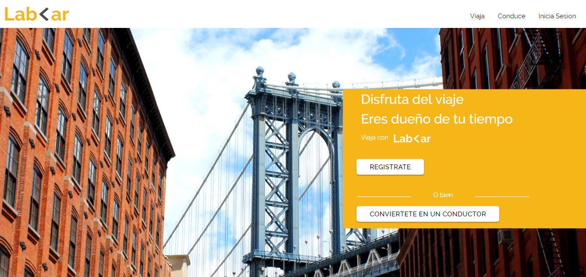
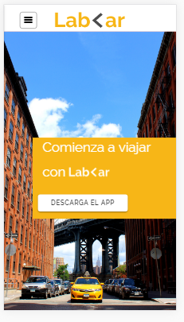
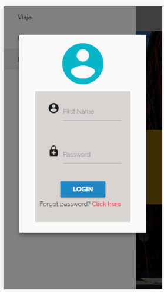

# LAB-<AR

El reto de esta unidad es recrear la pagina de Lab Car de modo desktop y mobile con ayuda del framework MATERIALIZE. Primero se realizo un fork al repositorio y clonarlo en mi maquina y agregar el codigo necesario para cumplir el reto.

## LA VERSIÓN WEB

## LA VERSIÓN MOBILE

## MODALES

